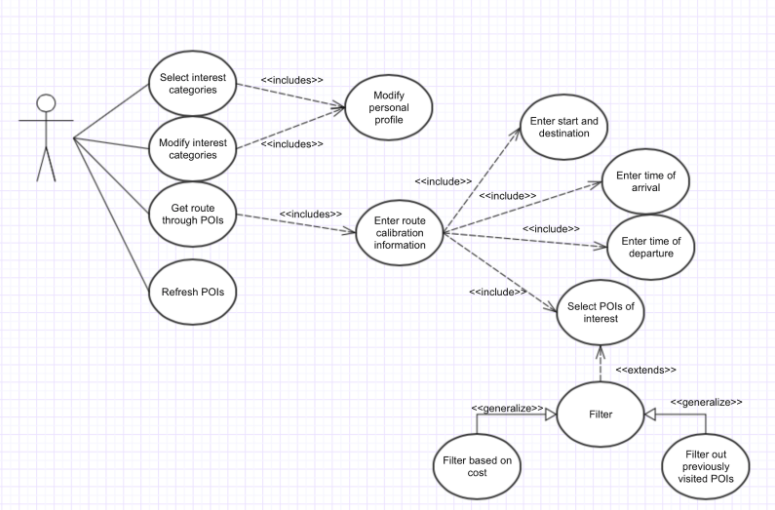

# Xplorer
Our team's project for CS 130 Fall 2017

Disclaimer: The github repository is private. It is however, shared with our TA.

# Motivation
A lot of us like to travel and explore new places. However, building an itinerary is a time consuming task, especially when your purpose of travel is a short business trip. Many times, it is quite cumbersome to find places in a new city based on your interests. It is even more difficult to plan out your day to visit these places in your free time during the day. More often than not, you just end up going to the local tourist attractions and call it a day. We wanted to build an app for those who like to travel and explore new places enabling them to do so with more ease. Users can thus use our app to plan out their day, visiting places in the city based on their interests.

Maps applications, such as Google Maps, currently restrict you to either searching specifically for one interest (food/grocery store/gas station), local tourist attractions, or offering the fastest route from a start point to a destination. These are all really useful features, but they do not take into account your personal interests and what the rest of your day looks like. When you’re travelling, you usually have an end destination in mind that you want to get to at a certain time.

Also, when one is planning an itinerary for a whole day, they might underestimate or overestimate the amount of time they will spend at a particular site. This could lead them to rush through or skip certain sites in their travel. We tell the user during the schedule planning process whether they will have enough time to visit each point of interest thoroughly and also how much time is remaining on their trip. The user can thus pick their own itinerary by selecting the places they are interested in visiting.

**Example:** You’re in New York for an interview and your interview is at 4pm. In this situation, you might want to leave your hotel in the morning and travel through some locations of interest to you and reach your interview location after sightseeing in New York. Or you might want to do sightseeing in New York after your interview before you head to the airport. Our application helps you do that and suggests a route that recommends locations en route to your destination, according to your interests and time constraints. You can then customize these places based on budget constraints and interests.

# Feature Description and Requirements
We introduced a landing screen with the logo of our application that shows every time it is launched. If it is the first time the application is launched, i.e. first time after its installation, the application will ask the user to enter their interests.

The **Interests View** displays four categories for the user to select from: Entertainment, Food, Drinks and Gardens. Initially in greyscale, each interest is colorized when selected. After the user has selected their interests, the user is taken to the map view.

The **Map View** shows the user’s location on the map along with the start and end locations. The route from start to destination, passing through the selected points of interests, is shown here. It makes use of the Google Maps API for iOS. The route along with the travel time is obtained using the Google Directions Web API. There are three options located in this view - a ‘Plan Your Trip’ button that takes the user to the time and location view, a ‘Directions’ button that opens the directions and route from the current location to final destination passing through the points of interest in the Google Maps application, and an ‘Interests’ button that takes the user to the interest view in case they want to update their interests.

A part of the Map View, the bottom half contains a table with the points of interests. In this feature, the user’s points of interests are displayed and selecting each point adds them to the route shown in the Map View. Each entry in the interest table contains the name of the point of interest, its address, and the price range of the place. All the information about each point of interest is acquired using the Google Places Web API. The addition of each place to the route can be toggled, causing the route to adjust each time so that it displays the most efficient route from the starting point to the destination passing through each point of interest. There is also a time remaining feature here which gets updated when the users add or remove a location from their itinerary. This lets them decide the optimum plan for the day that fits within their interests and schedule. Once they are satisfied with the itinerary, they can click on the go button which takes them to the Maps Application with the route open for them to follow in the navigation.

The **Time and Location View** is where the user is meant to enter the start and end times and locations. When the user enters a location, the autocomplete feature of the Google Places API suggests possible places that they can then select. There are a few conditions built in to baby-proof the application: the end time has to be after the start time and must also differ by at least the amount of time it takes to travel directly from the start to the end location. Also, the start and end location must be separate places. Once the user has entered valid locations and times, the location markers are displayed in the Map View along with the user’s points of interest.
 
To find the interests, the application conducts a radial search from the midpoint between the start and end locations. All places that match with the user’s interests are selected to be shown in the interest table.

# User Stories
1. A brand new user to the app will begin by downloading the app, entering his/her personal interests, and then specifying start time and departure location, as well as end time and arrival location.  The app will return a list of POIs (containing associated costs and transportation methods) that are along the fastest route to the arrival location.  The user, delighted by this automation, follows the itinerary in the app and enjoys the day!
1. A user who has used the app before will be able to open the app without specifying his/her interests again (but does have the option to change them if he/she so desires), enter the start and end times and locations, and then filter the returned list of POIs to get back places that match the user's interests.

# Usage scenarios:
### Scenario 1: User is totally new to the app
1. User downloads the app from the iOS App Store.
1. User is in a city he/she would like to explore, while honoring their commitments for the day.
1. User opens our iOS app on his/her iPhone.
1. The app asks him/her for his/her interests (examples being entertainment, bars, parks, restaurants etc.) after displaying the splash screen.
1. User sees home screen asking him/her for start destination, departure time, end destination and arrival time.
  1. If user wants to change his/her interests, he/she can click on the Interests button and change the interests.
1. After filling out the information, user sees a list of places as an itinerary, complete with POI addresses and associated costs.
1. User can adapt this list based on cost.
1. Upon finalizing the itinerary by selecting options of interest, the user sees a route from his/her start to end destination, with the places he/she selected as en route stops for visiting.
1. The app keeps track of what places the user visits based on the itinerary he/she follows.
1. The app tells the user how much time is left on the trip so that the user paces themselves accordingly.

### Scenario 2: User is exploring a city and wants to add points of interest to the trip
1. User opens app.
1. Splash screen displays and then takes the user to the home screen with departure time and location and arrival time and location.
  11. If user wants to change his/her interests, he/she can go click on the Interests button and change the interests.
1. After filling out the information, user sees a list of places as an itinerary, complete with POI distances and associated costs.
1. The user picks out the places they want to visit and sets off on their journey. The app lets the user know how much time is left on the trip
1. In the middle of the trip, the user decides to add one more place of interest to the route
  11. The app approximates the time the user will spend at the new point of interest and adds it to the route if there is sufficient time
  11. If there is not enough time left in the trip, the app lets the user know that there isn't enough time left to visit the new place

# UML Use Case Diagram

# Feasibility
It is inevitable that when visiting a new city, possibly for the first time, it requires an ample amount of meticulous planning and preparation. And while apps such as Google Maps, Yelp, and TripAdvisor might help you figure out popular destinations to visit, it is still currently up to the consumer to manually wade through a plethora of online suggestions, tourist attractions, and friends’ recommendations to see which places they can explore in a limited time frame at a reasonable travel distance and price.

Until now. What separates our application from the rest is that you don’t have to create your itinerary from scratch by consolidating all this information from different places and struggling to manually come up with the best possible plan. Our app will take into consideration the timeframe you’re free, the types of attractions you’re interested in, the location of the attraction, the average amount of time taken at popular destinations, and the approximate cost of the whole excursion. By doing all the heavy lifting for the user, this allows them to have a personalized and customizable plan in seconds.

To successfully develop and design this app, it is necessary to keep common pitfalls in mind and take the necessary precautions to avoid them throughout the course of the quarter. For iOS app development, most of us are familiar with the APIs we’re going to use such as Apple’s Cocoa and UIKit frameworks, the Google Maps API, and the Google Places API, all of which are extremely reliable and relatively accurate. We will have Google Maps Services objects from the Google Maps and Places APIs inside our UIViewControllers. Performance-wise, there are no expected speed delays associated with our app due to the relatively inexpensive operations of finding nearby attractions within a specified category and finding data such as prices and time taken to explore. The features list is enough to differentiate our product from others and make it an invaluable tool for anyone traveling to a new location, but not infeasible to implement during the quarter. Lastly, developing this software will not pose the problem of excessive cost, since all the APIs and technologies we are using are free.

**UML Class Diagram below**

**Explanation of Class Diagram:**
The app will be run by UIViewControllers, derived from UIViewController from the UIKit in iOS.  UIResponder and UIApplicationDelegate have been included because AppDelegate needs to implement and extend them, respectively.  UIViewController has been included because every ViewController will have to extend it.  All object types that begin with “GMS” indicate Google Mapping Services objects from the Google Maps API, as well as the Google Places API.  All other object types that begin with “UI” indicate views that were used from Apple’s UIKit for iOS.

# Directory Explanation

The project is an XCode Workspace. This is done so that it can incorporate the Google Map Services dependencies needed for our application. We can thus add our application code as one project and the Pods containing the Google APIs as another project. The **Pods** file contains the two dependencies we have used so far, namely Google Maps and Google Places. The GMS code is a combination of Swift and Objective-C classes.

The **Xplorer.xcodeproj** folder contains the main runnable part of the code, which calls upon the swift classes defined in the **Xplorer** folder (the source code). We have two main storyboards in the **Base.lproj** folder which define the high-level execution of our application. We also have auto-generated documentation in the Apple Doc format that was created by XCode in the Xplorer folder under **Documentation**. We used Jazzy to generate the documentation for our project. Jazzy is a downloadable software that creates a special website for your application containing all the documentation for it. The user just needs to add the relevant comments and descriptions for their functions, variables etc. Jazzy parses through the code and creates the documentation in an html page. The user can use markdown language too which will be reflected in the html documentation.

**XplorerTests** contains the test suites and unit tests we have created for our code. The **Assets** folder contains the images for our application which will end up being used in the ‘Interests’ section.

# Testing
### Overview
For our project, we used Xcode’s testing framework named XCTest. XCTest is very similar to the JUnit testing framework. Currently, we have three suites of tests containing in total around 20 test cases. Each test case can be run independently or entire suites can be run at once. Before each test is run, the functions setUp() and tearDown() are run before and after the test respectively. These functions contain code regarding allocation and deallocation of resources required by the test cases.
Following is the link to the folder containing the test cases: https://github.com/devandutta/CS_130_Fall_2017/tree/master/Xplorer/XplorerTests

### Testing Structure
Our testing suites are organized as follows:
1. Integration Test Suite - This test suite contains helper functions and one single integration test which covers the complete flow of our application.
2. InterestView Test Suite - This test suite contains around 10 unit test cases which completely test our interest view controller. This is the controller that the user interacts with the first time they open our application to select their interests.
3. TimeAndLocation Test Suite - This suite contains around 10 unit test cases which test the TimeAndLocationViewController, responsible for collecting all the user data required for planning the itinerary.

### Testing Methodology
Our test cases are void functions, which also return void. Each test case may have 0 or multiple assertions. The input to the test cases is usually passed in via class variables, such that the functions themselves take no arguments. Since the setup() and tearDown() functions are run before and after every test respectively, we do not have to worry about the state of the objects being used in our test cases. A generic example of our setup() function is described as follows:

  - Instantiate the main storyboard so that segues are setup
  - Instantiate any view controllers needed 
  - Instantiate any mock UI buttons/fields as needed
  - Access the view field of every instantiated controller, in order to run the viewDidLoad() built-in method for the controller

Our tearDown() function does not do anything since we are not allocating any resources that we need to free explicitly (Swift has garbage collection).
A test succeeds if none of the assertions fail, and the code being tested does not throw any exceptions. Our test cases have descriptive names which makes it very easy to know what exact functionality they are testing.

For our project, we added test cases for controllers as soon as the controllers were completed. Further changes to controllers resulted in changes to some of the test cases as well. Thus, we incorporated test driven development by making sure our test cases were always in sync with the actual code.

### Integration Test
Once all the functionality and unit testing of our application was complete, we wrote a single integration test for the application which does not use any mock objects, and tests the complete flow of our application. The integration test is described in detail as follows:
- In our setUp function, we first instantiate the storyboard, and all the controllers needed (TimeAndLocation, AutoComplete along with the MapView controller).
- Using real Google places (TLT restaurant in Westwood and Philz Coffee in Santa Monica, LA), we set the start and end locations.
- For the start and end times, we use the current time as the start time and current time + 2 hours as the end time.
- We then simulate the pressing of the done button just as a user would, by calling the doneButtonPressed() function instead of modifying the class variables directly or calling any helper functions. 
- If the code does not thrown any exceptions, then our input is correct and we transition to the MapViewController by using a segue.
- The unwindToMapView() function is called, which performs the actual routing by drawing the polyline and adding markers to the map view.
- We update the polyline to make sure it is as expected.
Thus, our integration test starts by simulating everything that a user would do, barring the selection of interests since that only happens once in the application and has already been tested via unit tests.

# Capability
**Shashank Khanna** has iOS development and System design. He has developed several iOS applications in Objective-C, one of which was chosen for the app store with over 200 downloads across three countries and another was responsible for winning the grand prize for HackGT. He has system design experience, through designing high-traffic backend web features for large e-commerce companies. His estimated role in the team would be to do class design and do the Objective-C implementation of the iOS application. He would be developing the application layer that will interact with the API, display the required data and contain the business logic. For Part A, Shashank contributed to the feature description, researched the Google Distance Matrix API, and estimated its feasibility as to displaying different route types within the application. 

**Devan Dutta** has built an Objective-C app, as well as a Swift app.  The Objective-C app was a math game that quizzed users with addition and subtraction questions, while tracking progress, increasing difficulty, and rewarding players with custom animations that he programmed himself.  The Swift app was a mapping app that made use of the MapKit and CoreLocation frameworks within iOS to display a user’s displacement from a starting point on a map, as well as a dashboard of useful metrics, like horizontal accuracy and speed.  In addition to these apps, he has interned twice at Symantec and once at Facebook and has therefore been introduced to development along various points of a software stack.  In Part A of the project, Devan created the usage scenarios, user stories, the UML class diagram and the UML use case diagram.  He also researched the Google Maps API and Google Places API and edited both the report and the presentation.

**Avirudh Theraja** has made several apps for the Android platform. These include a face identification app, a music downloader app and an app for an NGO (Non governmental organization). He has also used various APIs in making these apps and has a good general grasp of mobile development principles. In addition to mobile development, he has experience in backend API development through interning at Amazon Web Services. For part A of the project, he wrote the motivation and the features. He also contributed to the user interaction stories.

**Vamsi Mokkapati** has experience working in iOS development, web applications, developing backend web features, and front-end automation in both the Protractor framework for AngularJS and the Jasmine framework in Java. He developed the main front-end interface for Feedr, an iOS application that enables users to share their recipe ideas on social media, and has created a VR game simulation using WebGL on a NodeJS server. He has gained experience in software development both in backend and front-end through internships at Ethertronics and IBM. For part A of the project, he wrote the feasibility section and researched the APIs and technologies required to build this app.

**Rishabh Aggarwal** has User Interface and User Experience Design experience and has designed several apps and websites for startups and other clients including Spotify, Sonos, Facebook and the City of LA. He is also experienced in front end web development using Angular and React and has built web apps from the ground up at various hackathons. For Part A of the project, he came up with the idea and worked with the team to decide on the core features, motivation and the user stories. He also designed the mockups and prototypes for the app. 

**Dhruv Thakur** has experience in backend development and databases. He also has some experience in working with the user interface component of applications through work done in internships. While he does not have much experience in app development, he is armed with the drive and desire to learn so he does not consider many tasks outside his reach. For Part A, Dhruv worked on the PowerPoint presentation.

